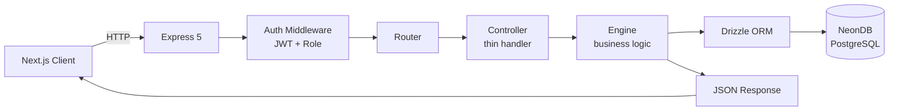
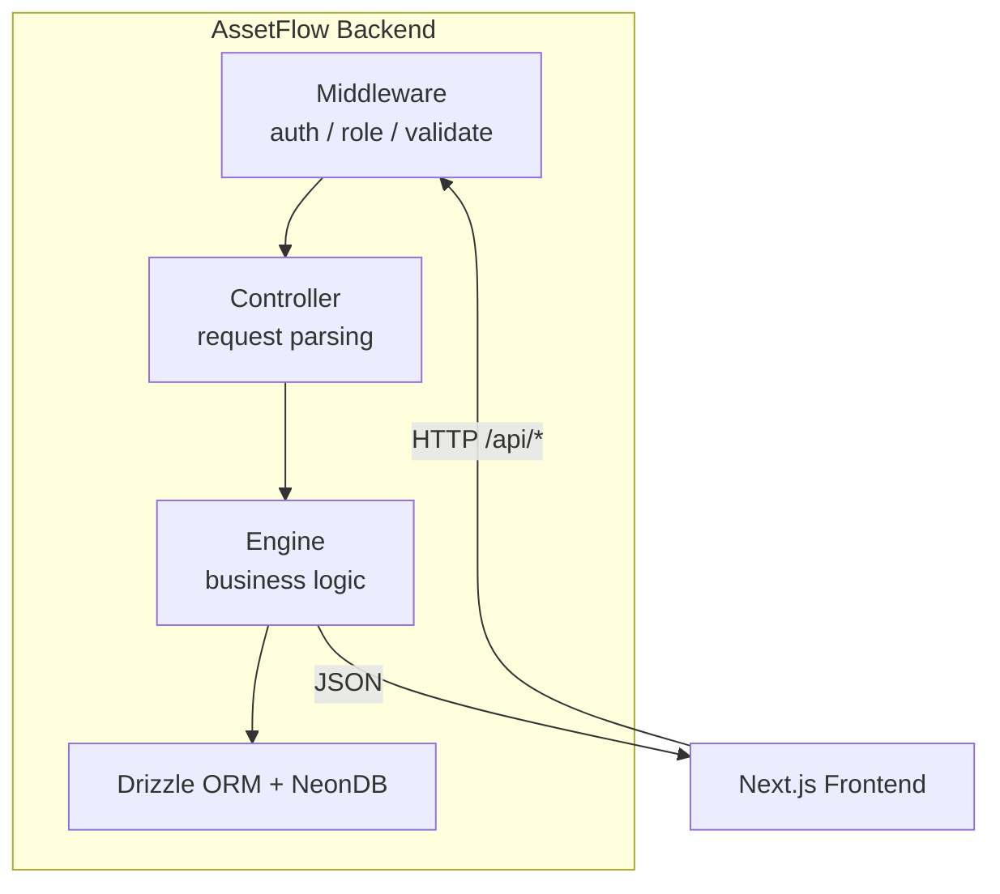
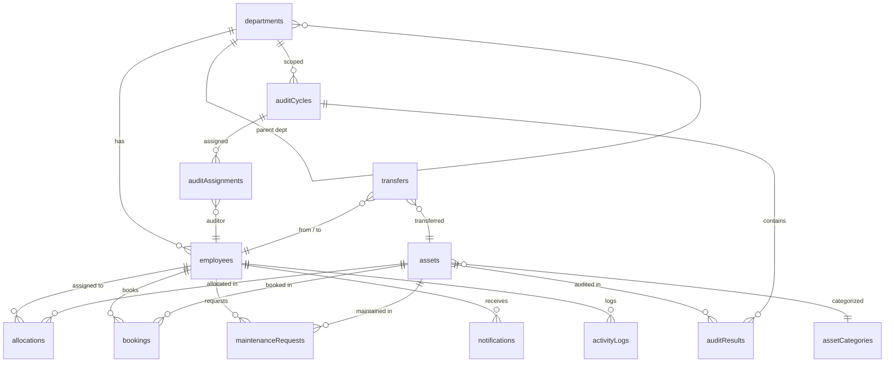

# AssetFlow OS

<p align="center">
  <strong>Enterprise Resource Intelligence</strong><br>
  <em>The operating system for enterprise resource management — unifying assets, people, bookings, maintenance, audits, and operational intelligence.</em>
</p>

<p align="center">
  
  
  
  
  
  
</p>

---

## Table of Contents

- [Architecture](#architecture)
- [Tech Stack](#tech-stack)
- [Schema](#schema-14-tables)
- [Quick Start](#quick-start)
- [Test Credentials](#test-credentials)
- [Roles & Permissions](#roles--permissions)
- [API Endpoints](#api-endpoints)
- [Frontend](#frontend)
- [File Structure](#file-structure)
- [Future Planning](#future-planning)

---

## Architecture

### Backend — Engine Architecture



The backend uses an **engine-based architecture**: thin controllers handle HTTP concerns (parsing, validation, response), while all business logic lives in seven isolated engines.

| Engine | Files | Responsibility |
|--------|-------|---------------|
| **Allocation** | `allocation.engine.js` | Assign & transfer assets with conflict detection. Prevents double-allocation, enforces transfer approval workflow, auto-updates asset status. Calls Policy Engine for guardrails. |
| **Booking** | `booking.engine.js` | Time-slot reservations with overlap validation. Calendar queries, status lifecycle (upcoming → ongoing → completed → cancelled). |
| **Maintenance** | `maintenance.engine.js` | Request → Approve/Reject → Assign Technician → In Progress → Resolved state machine. Auto-updates asset status to `under_maintenance` and back to `available`. |
| **Audit** | `audit.engine.js` | Cycle-based physical inventory audits. Create cycles with scope (department/location), assign auditors, mark results (verified/missing/damaged), auto-flag discrepancies on close. |
| **Policy** | `policy.engine.js` | Configurable business rules stored in the DB. Evaluates conditions (employee role, category, cost thresholds) and returns allow/block/require-approval. Priority-ordered rule matching. |
| **Intelligence** | `intelligence.engine.js` | Decision reasoning engine. Computes risk scores, remaining useful life, utilization stats, and human-readable explanations for every allocation and booking decision. |
| **Notification** | `notification.engine.js` | Event-driven alerts and activity logging. Called by all other engines on state changes. Supports in-app notifications and activity audit trails. |

### Data Flow



---

## Tech Stack

### Backend

| Layer | Technology | Purpose |
|-------|-----------|---------|
| **Runtime** | Node.js 20+ | Server-side JavaScript |
| **Framework** | Express 5 (ESM) | HTTP routing & middleware |
| **Database** | NeonDB (serverless PostgreSQL) | Cloud-native relational DB |
| **ORM** | Drizzle ORM + drizzle-kit | Type-safe queries, migrations |
| **Auth** | JWT + bcryptjs | Token-based auth, hashed passwords |
| **Validation** | Zod | Request body & schema validation |
| **File Upload** | Multer | Photo upload handling |
| **QR Code** | qrcode | Asset QR code generation |
| **Rate Limiting** | express-rate-limit | API throttling |

### Frontend

| Layer | Technology | Purpose |
|-------|-----------|---------|
| **Framework** | Next.js 16 (App Router) | React meta-framework with SSR/SSG |
| **Routing** | Route Groups `(dashboard)` | Co-located auth-protected pages |
| **Language** | TypeScript 5 | Type safety |
| **Styling** | Tailwind CSS 4 | Utility-first CSS |
| **Animation** | Motion 12 | Framer Motion API for animations |
| **Icons** | Lucide React, Phosphor Icons | Icon component libraries |
| **State** | React Context (AuthContext) | Client-side auth state |

---

## Schema (14 Tables)



| Table | Key Fields | Purpose |
|-------|-----------|---------|
| `departments` | name, parentDeptId, headEmployeeId | Organizational hierarchy |
| `employees` | email, passwordHash, role, departmentId | Users with role-based access |
| `assetCategories` | name, warrantyPeriodDays | Asset classification & warranty tracking |
| `assets` | name, assetTag, serialNumber, status, location, qrCode, isBookable | Core asset registry with QR codes |
| `allocations` | assetId, employeeId, expectedReturnDate, returnedAt | Asset assignment tracking |
| `transfers` | assetId, fromEmpId, toEmpId, approvedBy | Inter-employee asset transfers |
| `bookings` | assetId, bookerEmpId, startTime, endTime | Time-slot reservations |
| `maintenanceRequests` | assetId, description, priority, status, assignedTechnician | Maintenance workflow |
| `auditCycles` | title, scopeDeptId, startDate, endDate, status | Physical audit planning |
| `auditAssignments` | auditCycleId, auditorEmployeeId | Auditor-to-cycle mapping |
| `auditResults` | auditCycleId, assetId, status, notes | Per-asset audit outcomes |
| `notifications` | employeeId, type, message, isRead | In-app alerts |
| `activityLogs` | employeeId, action, details (JSONB) | Audit trail |
| `policies` | ruleType, conditions (JSONB), action, priority | Configurable guardrails |

---

## Quick Start

### Backend

```bash
# 1. Install dependencies
cd backend && npm install

# 2. Set up environment
cp .env.example .env
# Edit .env with your NeonDB connection string and a JWT secret

# 3. Push schema to database
npx drizzle-kit push

# 4. Seed demo data
node seed.js

# 5. Start server
node src/index.js           # production
npm run dev                  # development (nodemon)
```

### Frontend

```bash
# 1. Install dependencies
cd frontend && npm install

# 2. Set up environment
cp .env.example .env.local
# NEXT_PUBLIC_API_URL defaults to http://localhost:3001

# 3. Start dev server
npm run dev                  # Next.js dev server on :3000
npm run build                # production build (zero errors)
```

---

## Test Credentials

After seeding (`node seed.js`), 9 accounts are available:

### Admin & Management

| Email | Password | Role |
|-------|----------|------|
| `admin@assetflow.com` | `password123` | Admin — full system access |
| `head@assetflow.com` | `password123` | Department Head — approve requests within dept |
| `manager@assetflow.com` | `password123` | Asset Manager — manage assets, approve allocations/maintenance |

### Department Heads

| Email | Password | Department |
|-------|----------|-----------|
| `mkt_head@assetflow.com` | `password123` | Marketing |
| `hr_head@assetflow.com` | `password123` | Human Resources |
| `fin_head@assetflow.com` | `password123` | Finance |
| `qa_head@assetflow.com` | `password123` | Quality Assurance |

### Employees

| Email | Password | Department |
|-------|----------|-----------|
| `emp1@assetflow.com` | `password123` | Engineering |
| `emp2@assetflow.com` | `password123` | Engineering |
| `emp3@assetflow.com` | `password123` | Marketing |
| `emp4@assetflow.com` | `password123` | Human Resources |
| `emp5@assetflow.com` | `password123` | Finance |

**JWT Secret:** Auto-generated 512-bit cryptographically secure secret (see `backend/.env`).

---

## Roles & Permissions

| Role | Scope | Can |
|------|-------|-----|
| `admin` | Global | Create/manage departments, categories, users; promote roles; all CRUD; all approvals; create audits |
| `asset_manager` | Assets | Register/update assets; approve allocations, maintenance; view employees |
| `department_head` | Own department | Approve requests within dept; view dept assets & employees |
| `employee` | Self | Request assets, book resources, create maintenance requests, view own allocations |

---

## API Endpoints

### Auth

```
POST   /api/auth/signup                Register employee
POST   /api/auth/login                 Login → JWT token
GET    /api/auth/me                    Current user profile
```

### Directory

```
GET    /api/departments                 List all departments
POST   /api/departments                 Create department (admin)
PATCH  /api/departments/:id             Update department (admin)
GET    /api/categories                  List asset categories
POST   /api/categories                  Create category (admin)
PATCH  /api/categories/:id              Update category (admin)
GET    /api/employees                   List employees (admin/manager)
PATCH  /api/employees/:id/role          Promote role (admin)
PATCH  /api/employees/:id/status        Activate/deactivate (admin)
GET    /api/assets                      List assets (with search, category, status, location filters)
POST   /api/assets                      Register asset (asset_manager+)
GET    /api/assets/:id                  Asset detail
PATCH  /api/assets/:id                  Update asset
```

### Allocation

```
POST   /api/allocations                 Assign asset to employee
PATCH  /api/allocations/:id/transfer    Request asset transfer
PATCH  /api/allocations/:id/approve     Approve transfer (admin)
POST   /api/allocations/:id/return      Return asset
GET    /api/allocations                 List all allocations
GET    /api/allocations/mine            My current allocations
```

### Booking

```
POST   /api/bookings                    Book asset (time-slot)
PATCH  /api/bookings/:id/cancel         Cancel booking
GET    /api/bookings/calendar/:assetId  Calendar view for asset
GET    /api/bookings/mine               My bookings
```

### Maintenance

```
POST   /api/maintenance                 Create maintenance request
PATCH  /api/maintenance/:id/approve     Approve (manager/admin)
PATCH  /api/maintenance/:id/reject      Reject (manager/admin)
PATCH  /api/maintenance/:id/resolve     Mark resolved
GET    /api/maintenance                 List requests
GET    /api/maintenance/:id             Request detail
```

### Audit

```
POST   /api/audits/cycles               Create audit cycle (admin)
PATCH  /api/audits/cycles/:id/close     Close cycle → auto-flag discrepancies
GET    /api/audits/cycles               List audit cycles
GET    /api/audits/cycles/:id/results   Cycle audit results
POST   /api/audits/results              Mark asset audit result
```

### Reports & Analytics

```
GET    /api/reports/kpi                 Mission Control KPIs (dashboard)
GET    /api/reports/idle-assets         Assets not allocated in 90 days
GET    /api/reports/utilization         Allocation counts by department
GET    /api/reports/maintenance-frequency  Maintenance requests by category
GET    /api/reports/booking-heatmap     Booking density data
```

### Policies & Notifications

```
GET    /api/policies                    List policy rules
POST   /api/policies                    Create policy rule (admin)
PATCH  /api/policies/:id/toggle         Enable/disable rule
GET    /api/notifications               My notifications (?unread=true)
PATCH  /api/notifications/:id/read      Mark as read
GET    /api/activity-log                System activity audit trail
```

---

## Frontend

### Route Structure

```
/                           → Landing page (marketing site)
/(dashboard)/dashboard      → Mission Control KPI dashboard
/(dashboard)/assets         → Asset directory & registration
/(dashboard)/allocation     → Asset assignment & transfers
/(dashboard)/booking        → Time-slot reservations
/(dashboard)/maintenance    → Maintenance request workflow
/(dashboard)/audit          → Audit cycle management
/(dashboard)/reports        → Analytics & reports
/(dashboard)/activity       → Activity log
/(dashboard)/organization-setup → Departments, categories, employees
/login                      → Authentication
```

### Architecture

```
pages (App Router) → service layer (API calls) → backend (Express 5)
                      ↑
               TypeScript types ← shared interfaces
```

- **Service Layer:** 10 service modules (`src/services/`) — one per domain, all API calls centralized
- **TypeScript Types:** 9 type definition files (`src/types/`) — mirror backend schema
- **Auth State:** React Context (`AuthContext`) — JWT token management, role-based route protection
- **Styling:** Tailwind CSS 4 with custom theme (teal primary palette, Inter font)
- **Components:** Navbar, Sidebar, Modal, ToastProvider + landing page components
- **Build Status:** Zero errors, zero lint warnings

---

## File Structure

```
assetflow/
├── backend/
│   ├── src/
│   │   ├── config/
│   │   │   ├── db.js                  ← NeonDB + Drizzle connection
│   │   │   └── env.js                 ← Environment validation (Zod)
│   │   ├── models/
│   │   │   └── schema.ts              ← 14 Drizzle table definitions
│   │   ├── middleware/
│   │   │   ├── auth.middleware.js      ← JWT verification
│   │   │   ├── role.middleware.js      ← Role-based access control
│   │   │   └── validate.middleware.js  ← Zod request validation
│   │   ├── engines/                   ← 7 business logic engines
│   │   │   ├── allocation.engine.js   ← Assign & transfer with conflict detection
│   │   │   ├── booking.engine.js      ← Time-slot reservation with overlap validation
│   │   │   ├── maintenance.engine.js  ← Request→Approve→Assign→Resolve state machine
│   │   │   ├── audit.engine.js        ← Cycle-based inventory auditing
│   │   │   ├── policy.engine.js       ← Configurable business rule evaluation
│   │   │   ├── intelligence.engine.js ← Decision reasoning & risk scoring
│   │   │   └── notification.engine.js ← Event-driven alerts & activity logging
│   │   ├── controllers/               ← 12 thin route controllers
│   │   ├── routes/                    ← 11 API route definitions
│   │   └── index.js                   ← Express 5 entry point
│   ├── migrations/                    ← Drizzle Kit generated SQL
│   ├── drizzle.config.ts
│   ├── seed.js                        ← Demo data (9 users, 5 depts, 5 categories, 8 assets)
│   └── package.json
│
├── frontend/
│   ├── src/
│   │   ├── app/
│   │   │   ├── (dashboard)/           ← Auth-protected route group
│   │   │   │   ├── dashboard/         ← Mission Control KPIs
│   │   │   │   ├── assets/            ← Asset directory
│   │   │   │   ├── allocation/        ← Asset assignments
│   │   │   │   ├── booking/           ← Reservations
│   │   │   │   ├── maintenance/       ← Maintenance requests
│   │   │   │   ├── audit/             ← Audit cycles
│   │   │   │   ├── reports/           ← Analytics
│   │   │   │   ├── activity/          ← Activity log
│   │   │   │   └── organization-setup/ ← Admin config
│   │   │   ├── login/
│   │   │   ├── (marketing pages)/     ← Public site (about, pricing, product, etc.)
│   │   │   ├── layout.tsx
│   │   │   └── globals.css
│   │   ├── components/                ← Navbar, Sidebar, Modal, ToastProvider
│   │   ├── contexts/AuthContext.tsx    ← JWT auth state
│   │   ├── services/                  ← 10 API service modules
│   │   ├── types/                     ← 9 TypeScript type definitions
│   │   └── lib/                       ← Shared utilities
│   ├── next.config.ts
│   ├── tailwind.config.ts
│   └── package.json
│
└── README.md
```

---

## Future Planning

### Phase: Advanced Allocation & Booking Intelligence

- **Auto-Release Scheduling:** Assets with no booking activity for N days automatically return to the available pool with a notification sent to the last holder.
- **Conflict Resolution Dashboard:** Side-by-side calendar comparison showing overlapping requests with suggested alternative time slots.
- **Multi-Asset Booking Bundles:** Allow booking multiple assets simultaneously (e.g., "Conference Room Kit" = projector + laptop + sound system).

### Phase: Financial Integration

- **Depreciation Tracking:** Automatic straight-line/reducing-balance depreciation calculation per asset category. Historical cost vs. book value comparison.
- **Cost Center Chargebacks:** Tracks allocation costs by department for internal chargeback workflows. Exportable to finance systems.
- **Warranty Lifecycle Alerts:** Automated alerts when warranty expiry is within configurable thresholds (30/60/90 days). Integration with maintenance engine for pre-warranty checkups.

### Phase: AI & Predictive Analytics

- **Anomaly Detection (Allocation Engine):** ML-based detection of unusual allocation patterns — employees requesting beyond their department's typical profile, high-value assets being transferred at unusual frequency, etc.
- **Maintenance Prediction:** Predict likely asset failure based on category, age, condition history, and maintenance frequency. Suggest proactive maintenance schedules.
- **Natural Language Querying:** "Which assets are allocated to Engineering?" → auto-generated report from a plain-English input.
- **Smart Asset Tagging:** Auto-suggest categories, locations, and condition assessments from asset name and serial number patterns.

### Phase: Security & Compliance

- **Audit Trail Dashboard:** Full point-in-time asset state history with visual diff between audit snapshots.
- **SLA Tracking:** Configurable SLA rules per maintenance priority level. Dashboard for overdue SLAs and escalation triggers.
- **Policy Rule Builder UI:** Drag-and-drop policy condition builder replacing direct JSONB editing. Visual rule testing sandbox.

### Phase: Platform Extensions

- **External API Gateway:** Rate-limited, key-based API access for third-party integrators. Webhook callbacks for allocation, maintenance, and audit state changes.
- **SSO Integration:** OAuth 2.0 / OpenID Connect with support for Azure AD, Google Workspace, Okta.
- **Mobile Companion App:** QR code scanner for asset check-in/check-out. Push notifications for approvals and alerts.
- **Bulk Import/Export:** CSV/Excel import for asset registration (with validation preview). Export any report to PDF/XLSX.
- **Public Asset Booking Portal:** Self-service booking portal for bookable assets (meeting rooms, vehicles, equipment) visible to non-authenticated users with limited time-slot selection.

### Phase: Enterprise Structure & Policy Governance

- **Visual Department Organograms:** Dynamic, interactive drag-and-drop structural editor for managing department parent-child hierarchies.
- **Warranty Lifecycle Alerts:** Automated warning notifications when an asset's age nears the category's `warrantyPeriodDays` threshold (e.g., 30/60/90 days remaining).
- **Policy Compliance Sandbox:** A simulation tool for administrators to preview how a new policy (such as cost limits or role requirements) will affect current allocations before publishing it.
- **Location Geofencing & IoT Tracking:** Visual mapping of custom asset locations and alerting if assets are detected outside of their registered location.

### Phase: Operational Excellence

- **Soft Delete & Archival:** Configurable retention policies with recycle bin for assets, allocations, and audit records.
- **Multi-Tenancy:** Organization-scoped data isolation for SaaS deployment model. Custom branding per tenant.
- **Backup & DR:** Automated NeonDB branch-based backup strategy. Point-in-time recovery testing workflow.

---

Built with care for enterprise resource intelligence.
